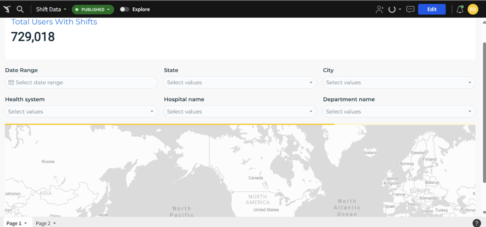

# Bryson's Portfolio

Welcome to my portfolio! An outline of my completed projects that highlight my abilities in data analytics, reporting, and visualization can be found below. Every project shows my capacity for data analysis, insight generation, and clear communication of results.

---

## Projects

### 1. **Shift Data Model**
   - **Description**: 
     The **Shift Data Model** is an interactive dashboard showcasing shift data across the United States for the Nursegrid app. Users can select filters to view detailed information on all users who had shifts. This model provides valuable insights into nurse shift activity by allowing users to filter and explore data based on multiple dimensions, including date, state, city, hospital, and department.
   - **Tools Used**: Excel, SQL.
     
   - **Skills Demonstrated**:
     - Writing and optimizing SQL queries to clean, transform, and retrieve large datasets.
     - Designing an interactive, filterable dashboard in Snowflake for a user-friendly experience.
     - Data storytelling by presenting key metrics and trends.
       
   - **Key Features**:
     - **Filtering**: Select a filter to dynamically display user-specific shift data.
     - **Exportable Reports**: Designed for easy sharing and integration into reporting workflows.
       
   - **Key Insights**:
     - Identified states and cities with the highest concentration of shifts and staffing needs.
     - Revealed trends in user participation, highlighting opportunities for better workforce management.

   **Image Previews**:
   - *Overview of the dashboard layout:*
       
   - *Detailed view of state-specific user data:*
       

---

## 2. **Free Trial Dashboard**

**Description**:  
The Free Trial Dashboard analyzes the performance and engagement of users with Nursegrid Manager's free trial. It displays key metrics and charts to visualize how trial users interacted with the platform, highlighting opportunities for conversion to paid subscriptions.
- **Tools Used**: Excel, SQL, SigmaBI
- **Skills Demonstrated**:  
   - Analyzing and visualizing data to track user behavior during a free trial.  
   - Creating impactful charts and graphs to display KPIs.  
- **Key Features**:  
   - **User Engagement Metrics**: Track the number of users engaging with the free trial over time.   
   - **Trial Duration Analysis**: Analyze how the length of the free trial affects user engagement and conversion.
- **Key Insights**:  
   - Identified patterns in feature usage that correlate with higher conversion rates.  
   - Provided insights into optimizing the free trial experience to maximize user conversion.

**Image Previews**:
- Overview of free trial user engagement:  
  

- Feature usage analysis chart:  
  
